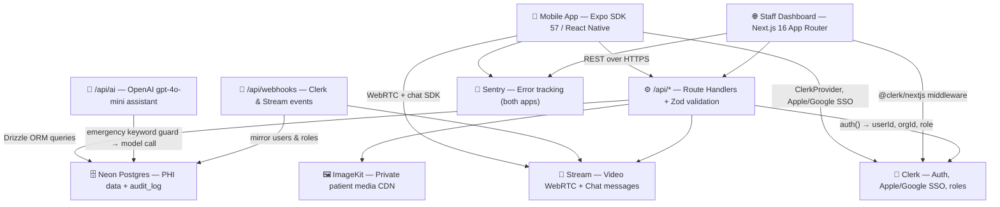
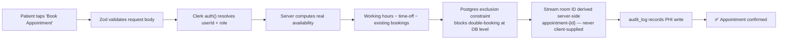
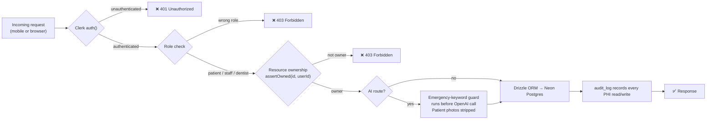

# 🦷 Dental App

**A full-stack, production-grade dental clinic platform — mobile patient app + staff web dashboard — built as a single monorepo.**

      

    

    

    

> **Author:** [GiorgiKavtaradze](https://github.com/GiorgiKavtaradze-prog) &nbsp;·&nbsp; **Repo:** [GiorgiKavtaradze-prog/dental-app](https://github.com/GiorgiKavtaradze-prog/dental-app)

---

## 📖 Overview

**Dental App** is a monorepo combining a patient-facing **mobile application** and a **staff web dashboard** for a single dental practice — designed for real-world clinic operation from day one.

- **Patients** sign in with Apple or Google, complete a medical intake, book real appointments from live clinic availability, securely chat with staff, and join scheduled video consultations — all from their phone.
- **Staff** manage the daily schedule, patient records, chat threads, and post-op notes from a Next.js dashboard that doubles as the REST API and webhook server.

Two core principles govern every design decision:

| Principle                         | Detail                                                                                                                                                                   |
| --------------------------------- | ------------------------------------------------------------------------------------------------------------------------------------------------------------------------ |
| **`apps/web` is the backend**     | It owns the Postgres schema (Drizzle ORM on Neon), all business logic, and every external integration. The mobile app is a thin rendering layer.                         |
| **Third parties own the minimum** | Clerk holds identity only; Stream holds call and message content only. Everything clinical lives in our own database, with PHI reads and writes recorded in `audit_log`. |

---

## ✨ Features

| Area                   | Description                                                                                                                                                |
| ---------------------- | ---------------------------------------------------------------------------------------------------------------------------------------------------------- |
| 🔐 **Authentication**  | Apple + Google SSO via Clerk; roles (`patient`, `staff`, `dentist`) mirrored into Postgres by webhook                                                      |
| 📋 **Onboarding**      | 4-step intake — profile, medical history, primary concern, notifications permission                                                                        |
| 📅 **Smart Booking**   | Real availability = working hours − time-off − existing bookings; duration computed server-side; double-booking blocked by a Postgres exclusion constraint |
| 📹 **Teleconsults**    | Scheduled video/audio calls via Stream Video (WebRTC); room ID is derived server-side (`appointment-{id}`), never client-supplied                          |
| 💬 **Clinic Chat**     | Secure patient ↔ clinic messaging via Stream Chat with photo attachments                                                                                   |
| 🤖 **AI Assistant**    | Education & triage only (`gpt-4o-mini`); emergency-keyword guard runs before any model call; patient photos are **never** sent to OpenAI                   |
| 👨‍👩‍👧 **Family Accounts** | One user account, N patient profiles — exactly one `"self"` profile; appointments reference patients, not users                                            |
| 🗂️ **Visit History**   | Complete past-appointment list with staff-authored post-op notes                                                                                           |
| 🌐 **Public Site**     | Landing page, Terms of Service, and Privacy Policy (draft banner until legal sign-off)                                                                     |
| 📡 **Observability**   | Sentry on both apps; PHI never leaves the compliance boundary                                                                                              |

---

## 🏗️ Architecture

### System diagram



### One request, one booking



### Why the server can't be abused



---

## 🚀 Getting Started

### Prerequisites

- **Node.js ≥ 22** and npm
- A **[Neon](https://neon.tech)** Postgres database (free tier works)
- API keys for: **[Clerk](https://clerk.com)**, **[Stream](https://getstream.io)**, **[OpenAI](https://platform.openai.com)**, **[ImageKit](https://imagekit.io)**, **[Sentry](https://sentry.io)** (all have free tiers)

---

### Step 1 — Install dependencies

```bash
npm install
```

---

### Step 2 — Configure the web app

```bash
cp apps/web/.env.example apps/web/.env
```

Edit `apps/web/.env` and fill in the following:

| Variable                                          | Purpose                                                          |
| ------------------------------------------------- | ---------------------------------------------------------------- |
| `DATABASE_URL`                                    | Neon Postgres connection string                                  |
| `CLERK_SECRET_KEY`                                | Clerk server-side secret key                                     |
| `NEXT_PUBLIC_CLERK_PUBLISHABLE_KEY`               | Clerk client-side publishable key                                |
| `NEXT_PUBLIC_CLERK_SIGN_IN_URL`                   | Route for sign-in page (`/sign-in`)                              |
| `NEXT_PUBLIC_CLERK_SIGN_UP_URL`                   | Route for sign-up page (`/sign-up`)                              |
| `NEXT_PUBLIC_CLERK_SIGN_IN_FALLBACK_REDIRECT_URL` | Post-sign-in redirect URL                                        |
| `NEXT_PUBLIC_CLERK_SIGN_UP_FALLBACK_REDIRECT_URL` | Post-sign-up redirect URL                                        |
| `NEXT_PUBLIC_STREAM_API_KEY`                      | Stream Chat + Video (public key)                                 |
| `STREAM_API_SECRET`                               | Stream server-side secret                                        |
| `OPENAI_API_KEY`                                  | AI assistant API key                                             |
| `IMAGEKIT_PUBLIC_KEY`                             | ImageKit upload authentication                                   |
| `IMAGEKIT_PRIVATE_KEY`                            | ImageKit server operations                                       |
| `IMAGEKIT_URL_ENDPOINT`                           | ImageKit CDN base URL                                            |
| `NEXT_PUBLIC_SENTRY_DSN`                          | Sentry error tracking DSN                                        |
| `CLINIC_TZ`                                       | Clinic timezone for all scheduling (default: `America/New_York`) |

---

### Step 3 — Migrate and seed the database

```bash
npm run db:migrate        # Apply Drizzle schema migrations to Neon
npm run db:seed           # Seed demo data: dentists, services, working hours
npm run db:seed:stream    # Mirror demo users into Stream
```

> **Tip:** Run `npm run db:studio` to open Drizzle Studio for a visual database browser.

---

### Step 4 — Run the web dashboard

```bash
npm run web               # → http://localhost:3000
```

---

```bash
npm run mobile            # Start Metro bundler

# Build and run locally
npx expo run:ios          # iOS simulator or physical device
npx expo run:android      # Android emulator or physical device

# Build with EAS
npm run build:ios
npm run build:android
```

---

## 🔒 Security & Compliance

| Concern                       | Approach                                                                                                                         |
| ----------------------------- | -------------------------------------------------------------------------------------------------------------------------------- |
| **PHI Boundary**              | All patient health information is stored exclusively in Neon Postgres. No PHI is transmitted to OpenAI or third-party analytics. |
| **Audit Log**                 | Every PHI read and write is recorded in the `audit_log` table.                                                                   |
| **AI Guardrails**             | Emergency-keyword detection runs server-side before any OpenAI API call. Patient photos are never included in AI requests.       |
| **Double-Booking Prevention** | A Postgres exclusion constraint enforces non-overlapping appointment windows at the database level.                              |
| **Token Scoping**             | Stream room IDs are derived server-side from appointment IDs; clients never supply or forge room tokens.                         |

---

## 🧪 Testing

```bash
npm run test        # Run Vitest unit suite (apps/web)
npm run typecheck   # TypeScript type-check all workspaces
```

---

## 📄 License

Released under the [MIT License](./LICENSE) — Copyright © 2026 [GiorgiKavtaradze](https://github.com/GiorgiKavtaradze-prog).

Third-party services used by this project (Clerk, Stream, OpenAI, ImageKit, Sentry, Neon) are governed by their own terms of service. This license covers the repository source code only.

---

Made with ❤️ by [GiorgiKavtaradze](https://github.com/GiorgiKavtaradze-prog)
